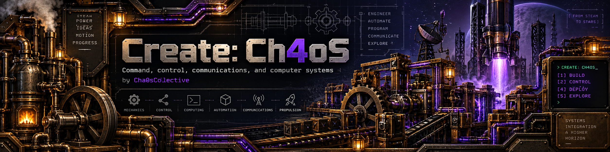

# Create: Ch4oS

A Minecraft 1.21.1 / NeoForge 21.1.248 modpack for factories, vehicles and exploration.

## Play

Install [Prism Launcher](https://prismlauncher.org/), choose **Add Instance → Import**,
and paste this link or select the [Public ZIP](https://github.com/Cha0sCollective/Create-Ch4os-Packwiz/releases/download/channel-public/Create-Ch4oS-Public-Prism.zip):

```text
https://github.com/Cha0sCollective/Create-Ch4os-Packwiz/releases/download/channel-public/Create-Ch4oS-Public-Prism.zip
```

Use Java 21, sign in with Minecraft and launch. Allow the Packwiz pre-launch
command when prompted; it downloads the mods and keeps the pack updated.
| Install choice | Updates |
| --- | --- |
| [Public](https://github.com/Cha0sCollective/Create-Ch4os-Packwiz/releases/tag/channel-public) | Follows public; recommended for normal play |
| [Beta](https://github.com/Cha0sCollective/Create-Ch4os-Packwiz/releases/tag/channel-beta) | Follows beta changes for testing |
| [Numbered releases](https://github.com/Cha0sCollective/Create-Ch4os-Packwiz/releases) | Stay on the exact tagged version |

[Client setup and memory advice](docs/PRISM.md) · [Server setup with AMP](docs/SERVER.md)

## About the pack

The pack includes Distant Horizons, Tectonic, Terralith and Create integrations.
Prism manages your client; AMP manages your server. Packwiz installs the pack files
for both. No separate Ch4oS installer is needed.

Mods download from their providers, except Industrialized Architecture, which uses
our unchanged MIT-licensed release mirror. The import ZIP contains no gameplay JARs.

## Contribute

`public` supplies player updates, `main` holds the accepted release, and `beta`
is for testing. Changes reach players only when promoted to `public`.
Push beta normally, then run **Actions → Promote beta to public** with the next
version. Review the results and approve publication yourself; one maintainer is
enough. See the [release process](distribution/README.md).

[Beta map-sharing setup](docs/MAPS.md) · [Contributing](docs/CONTRIBUTING.md) · [Configuration](docs/CONFIGURATION.md) ·
[Mod and resource-pack sources](docs/MOD-SOURCES.md) · [Build a ZIP](distribution/README.md)

Project-authored files use the [MIT license](LICENSE.txt). Mods retain their own licenses.
